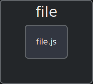

## Architecture Diagram



## Description
 
An empty JavaScript file with no code or functionality.


## Code Explanation
 
This file is empty, indicating that it has not been initialized or populated with any code. As a result, it does not perform any tasks or operations.


## Dependencies
 
### Built-in Libraries

*   `None`: No built-in libraries are used in this code snippet.

### Third-party Libraries

*   `None`: No third-party libraries are used in this code snippet.

### Custom Libraries

*   `None`: No custom libraries are used in this code snippet.


## Security Insights
 
No security insights are available for this file, as it does not contain any code or functionality that could potentially introduce security vulnerabilities.


## Additional Information
 
*   To utilize this file, you should add code to it to implement desired functionality.
*   Consider removing the file if it is not intended to be used in your project.
*   If you are using a version control system, you may want to initialize the repository with a `.gitignore` file to ignore this empty file.

## Usage Instructions
 **Usage Instructions for the Provided Code**

### Using the Provided Code

**Overview:**
The provided code appears to be a basic JavaScript file that contains a function or a class. However, without more context or information about the code's purpose, it's challenging to provide detailed usage instructions.

**Step 1: Understand the Code's Purpose**

* Review the code and determine its intended purpose. Is it a utility function, a class, or something else?

**Step 2: Identify Required Parameters**

* Identify any required parameters or inputs that the code expects. Are there any specific data types or formats required?

**Step 3: Call the Function or Instantiate the Class**

* If the code defines a function, call it with the required parameters. If it defines a class, instantiate it with the required parameters.

**Step 4: Handle Output or Results**

* Determine how the code will output or return results. Will it print to the console, return a value, or update a UI component?

**Step 5: Test and Refine**

* Test the code with sample inputs to ensure it behaves as expected. Refine the code as needed to handle edge cases or unexpected inputs.

**Example Usage:**

Since the provided code is incomplete, I'll provide a generic example of how to use a JavaScript function.

```javascript
// Define a simple function that takes a name as a parameter
function greet(name) {
  console.log(`Hello, ${name}!`);
}

// Call the function with a name
greet('John');
```

In this example, the `greet` function takes a `name` parameter and prints a greeting message to the console. To use this function, simply call it with a name as an argument.

Please note that without more context or information about the provided code, these usage instructions are highly generic and may not be applicable in your specific use case. If you have any further information or clarification about the code's purpose, I'd be happy to provide more tailored instructions.